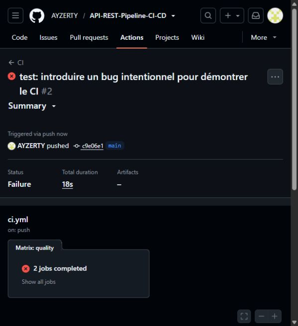
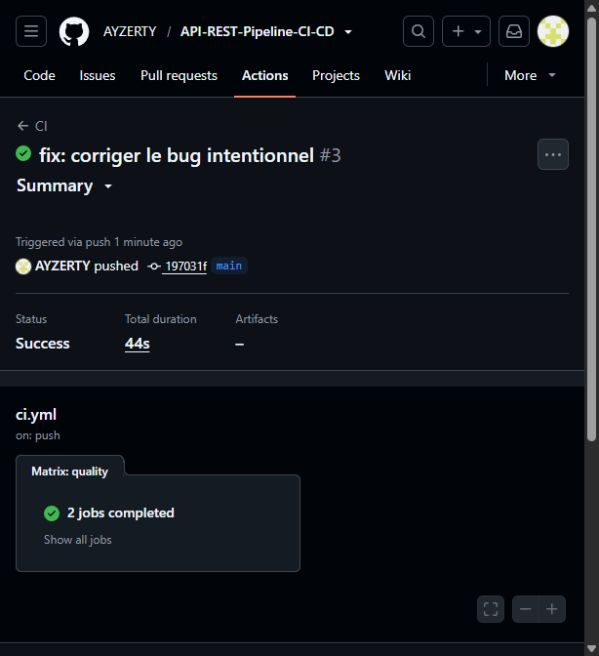

# Captures du cycle Red → Green

Le bug volontaire remplace le statut 201 de POST /students par 200. Les tests échouent, puis réussissent après correction.

- [Pipeline rouge](https://github.com/AYZERTY/API-REST-Pipeline-CI-CD/actions/runs/37649553597) — commit c9e06e1, 7 octobre 2026.
- [Pipeline vert après correction](https://github.com/AYZERTY/API-REST-Pipeline-CI-CD/actions/runs/37823904766) — commit 197031f, 8 octobre 2026.

## Rouge

## Vert

